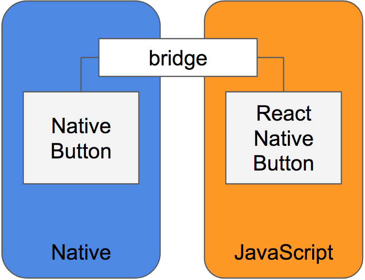
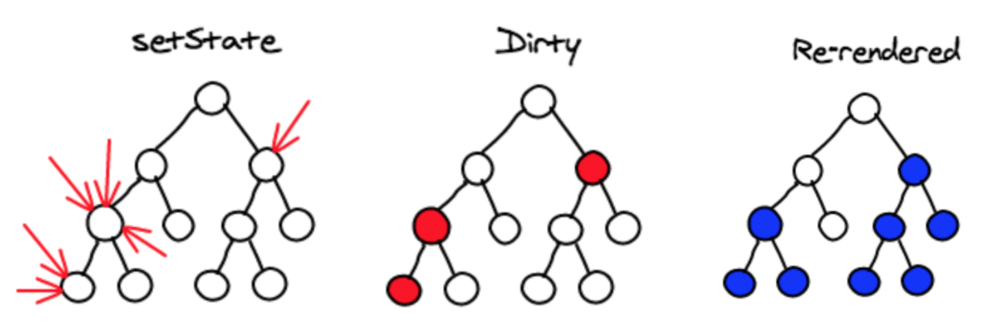

# 우아한 형제들 기술 블로그 React Native

## 리액트 네이티 동작
자바스트립트가 네이티브에서 동작하기 위해서는 네이티브 코드가 필요하다.

예를들어,
먼저 자바스트립트에서 버튼을 구성하고 네이티브 버튼기능을 수행할 컨트롤과 bridge로 통신한다.

React Native 는 네이티브 경험 없이도 애플리케이션을 만들 수 있다. 
화면구성을 위한 다양한 컴포넌트가 존재(Button, RefreshControl, WebView)가 있기 때문에
네이티브 개발을 줄여준다.

제공되지 않은 컴포넌트 화면 구성을 위해서는 라이브러리를 찾거나 직접구현해야 한다.

React Native는 네이티브 개발의 필요성을 줄여주지만 여전히 네이티 개발이 필요하다.



## 네이티브와 리액트 네이티브의 개발과정
* 네이티브
    * 테스트 디바이스에 앱을 설치하고 하는 과정을 반복해야 한다.
* 리액트 네이티브
    * 로컬의 노드 서버에 published JavaScript 코드를 수행하기 때문에, 에뮬레이터를 비롯한 실제 
    디바이스에서의 변경사항은 앱의 컴파일 없이 새로고침으로 충분하다.
    * ```<react-native run 'platform'>```
        1. index.platform.bundle을 게시하는 노드 웹 서버를 실행
        1. platform 에 해당하는 IOS/Andriod 프로젝트를 빌드하고 에뮬레이터/디바이스 설치된다.
        로컬에 구동된 index.platform.bundle을 다운 받는다.
        1.  다운로드 후에 React Native 빌드 프로세스를 통해 JavaScript 런타임 환경으로 전달되어 프로젝트가 구동된다.
        이후 부터는 JavaScript 의 수정이 생기면 새로고침만으로 변경사항을 확인할 수 있다.
        여러대의 기기에 한 번 설치 후에는 다시 컴파일이 없이 변경사항을 확일 할 수 있다.
        Code Push를 사용하여 이미 배포된 애플리케이션의 재배포 없이 JavaScript 수정이 가능하다.         

*  네이티브 영역의 코드가 변경되야한다면! 네.. 다시 패키징하는 방법으로 배포해야합니다.

## 리액트 네이티브 개발 준비
* 네이티브 지식도 필요하다.

## 효율적인 리액트 네이티 앱 만들기


###  pureComponent shouldComponentUpdate
* pureComponent 는 props 와 state를 shallow level에서 비교한 결과로 render 여부를 판단하기 때문에
의도하지 않은 render 가 발생할 수 있다.
* shouldComponentUpdate 에서 deep-compare 는 권장항목이 아니다.
    * render 판단에 소비하는시간이 render 시간보다 길어질 것을 우려함.
* 효율적인 Render
    * 각 컴포넌트를 목적에 따라 작게 나누고 컴포넌트는 필요한 props와 state만 다루는것이 
    render 수행시점을 쉽게 판단하게 한다.
    

Reference
--
* https://woowabros.github.io/experience/2018/05/19/build-app-by-react-native.html