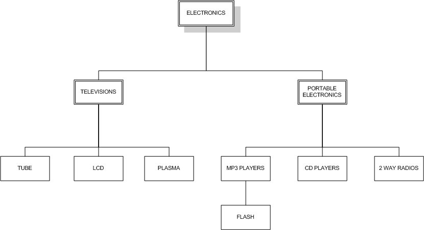
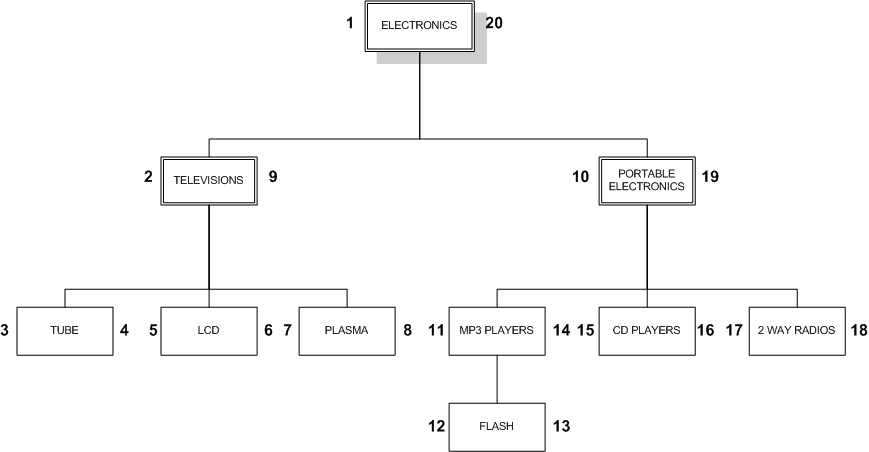

# [Managing Hierarchical Data in MySQL](http://mikehillyer.com/articles/managing-hierarchical-data-in-mysql/)
계층적 데이터 관리는 관계형데이터베이스의 목적이 아니다.
전통적인 인접 목록 모델에서 시작하여 MySql에서 계층적 데이터를 다루기 위한 두가지 모델을 소개한다. 

## ADJACENCY LIST MODEL 인접 목록 모델 


```shell script
CREATE TABLE category ( 
        category_id INT AUTO_INCREMENT 기본 키, 
        이름 VARCHAR (20) NOT NULL, 
        부모 INT DEFAULT NULL 
); 

범주 값에 삽입 (1, 'ELECTRONICS', NULL), (2, 'TELEVISIONS', 1), (3, 'TUBE', 2), 
        (4, 'LCD', 2), (5, 'PLASMA' , 2), (6, '휴대용 전자 제품', 1), (7, 'MP3 플레이어', 6), (8, '플래시', 7), 
        (9, 'CD 플레이어', 6), (10, '2 웨이 라디오', 6); 

SELECT * FROM 카테고리 ORDER BY category_id; 
+ ------------- + ---------------------- + -------- + 
| category_id | 이름 | 부모 | 
+ ------------- + ---------------------- + -------- + 
| 1 | 전자 제품 | NULL | 
| 2 | 텔레비전 | 1 |
| 3 | 관 | 2 | 
| 4 | LCD | 2 | 
| 5 | 플라즈마 | 2 | 
| 6 | 휴대용 전자 제품 | 1 | 
| 7 | MP3 플레이어 | 6 | 
| 8 | 플래시 | 7 | 
| 9 | CD 플레이어 | 6 | 
| 10 | 2 웨이 라디오 | 6 | 
+ ------------- + ---------------------- + -------- + 
10 행 세트 (0.00 초)
```
* 각 항목에는 상위 항목에 대한 포인터가 존재한다. 최상위 요소일 경우 상위요소에 대해 NULL 이다.
* 매우 간단
* 클라이언트측 코드에서는 상당히 쉽게 처리할 수 있지만 순수 SQL에서는 모델 작업이 문제가 될 수 있다.

### 전체 트리 검색
계층적 데이터를 처리할 때,
전체 트리 표시를 가장 먼저 한다. 
* 순수 SQL에서 자체 조인을 사용하는것이 가장 일반적이다.
```shell script
SELECT t1.name AS lev1, t2.name as lev2, t3.name as lev3, t4.name as lev4
FROM category AS t1
LEFT JOIN category AS t2 ON t2.parent = t1.category_id
LEFT JOIN category AS t3 ON t3.parent = t2.category_id
LEFT JOIN category AS t4 ON t4.parent = t3.category_id
WHERE t1.name = 'ELECTRONICS';

+-------------+----------------------+--------------+-------+
| lev1        | lev2                 | lev3         | lev4  |
+-------------+----------------------+--------------+-------+
| ELECTRONICS | TELEVISIONS          | TUBE         | NULL  |
| ELECTRONICS | TELEVISIONS          | LCD          | NULL  |
| ELECTRONICS | TELEVISIONS          | PLASMA       | NULL  |
| ELECTRONICS | PORTABLE ELECTRONICS | MP3 PLAYERS  | FLASH |
| ELECTRONICS | PORTABLE ELECTRONICS | CD PLAYERS   | NULL  |
| ELECTRONICS | PORTABLE ELECTRONICS | 2 WAY RADIOS | NULL  |
+-------------+----------------------+--------------+-------+
6 rows in set (0.00 sec)
``` 

### 모든 리프 노트 찾기  
* left join 을 사용하여 트리에서 하위노드가 없는 모든 리프 노드를 찾을 수 있다.
```shell script
SELECT t1.name FROM
category AS t1 LEFT JOIN category as t2
ON t1.category_id = t2.parent
WHERE t2.category_id IS NULL;

+--------------+
| name         |
+--------------+
| TUBE         |
| LCD          |
| PLASMA       |
| FLASH        |
| CD PLAYERS   |
| 2 WAY RADIOS |
+--------------+
```

### 단일 경로 검색
```shell script
   SELECT t1.name AS lev1, t2.name as lev2, t3.name as lev3, t4.name as lev4
   FROM category AS t1
   LEFT JOIN category AS t2 ON t2.parent = t1.category_id
   LEFT JOIN category AS t3 ON t3.parent = t2.category_id
   LEFT JOIN category AS t4 ON t4.parent = t3.category_id
   WHERE t1.name = 'ELECTRONICS' AND t4.name = 'FLASH';
   
   +-------------+----------------------+-------------+-------+
   | lev1        | lev2                 | lev3        | lev4  |
   +-------------+----------------------+-------------+-------+
   | ELECTRONICS | PORTABLE ELECTRONICS | MP3 PLAYERS | FLASH |
   +-------------+----------------------+-------------+-------+
   1 row in set (0.01 sec)
   ```

모든 수준 하나하나에 저체 조인이 필요하며 결합이 복잡해짐에 따라 성능이 저하된다. 

### 인접성 목록 모델의 한계
1. 카테고리의 전체 경로를 보기 전에 카테고리의 레벨을 알아야 한다.
2. 노드를 삭제할 때 특별한 주의가 필요하다.
* 절차적 프로그래밍을 사용하여 트리의 맨 아래에서 시작하여 위쪽으로 반복하여 경로를 반환할 수 있다. 
* 하나의 하위 요소를 승격시키고 나머지 하위를 새 상위를 가리키도록 재정렬하여 삭제할수 있다. 

## Nested Set Model 중첩 세트 모델

* 노드와 선이 아 중첩 컨테이너로의 계층 방식 
* 노드의 중첩을 나타내는 왼쪽 및 오른쪽 값을 사용하여이 형식의 계층 구조를 테이블에 나타냅니다.
```shell script
CREATE TABLE nested_category (
        category_id INT AUTO_INCREMENT PRIMARY KEY,
        name VARCHAR(20) NOT NULL,
        lft INT NOT NULL,
        rgt INT NOT NULL
);

INSERT INTO nested_category VALUES(1,'ELECTRONICS',1,20),(2,'TELEVISIONS',2,9),(3,'TUBE',3,4),
 (4,'LCD',5,6),(5,'PLASMA',7,8),(6,'PORTABLE ELECTRONICS',10,19),(7,'MP3 PLAYERS',11,14),(8,'FLASH',12,13),
 (9,'CD PLAYERS',15,16),(10,'2 WAY RADIOS',17,18);

SELECT * FROM nested_category ORDER BY category_id;

+-------------+----------------------+-----+-----+
| category_id | name                 | lft | rgt |
+-------------+----------------------+-----+-----+
|           1 | ELECTRONICS          |   1 |  20 |
|           2 | TELEVISIONS          |   2 |   9 |
|           3 | TUBE                 |   3 |   4 |
|           4 | LCD                  |   5 |   6 |
|           5 | PLASMA               |   7 |   8 |
|           6 | PORTABLE ELECTRONICS |  10 |  19 |
|           7 | MP3 PLAYERS          |  11 |  14 |
|           8 | FLASH                |  12 |  13 |
|           9 | CD PLAYERS           |  15 |  16 |
|          10 | 2 WAY RADIOS         |  17 |  18 |
+-------------+----------------------+-----+-----+
```
* 왼쪽 오른쪽 값의 결정 : 노드의 가장 왼쪽부터 번호를 매긴다.


* 트리에 적용 -> modified preorder tree traversal algorithm.


### 전체 트리 검색
* 노드의 lft 값이 항상 부모의 lft 보다 크고 rgt 보다 작다
* 부모와 노드를 연결하는 self 조인을 사용하여 전체 트리를 검색한다.
* 트리 깊이에 상관없이 작동한다. 
```shell script
SELECT node.name
FROM nested_category AS node,
        nested_category AS parent
WHERE node.lft BETWEEN parent.lft AND parent.rgt
        AND parent.name = 'ELECTRONICS'
ORDER BY node.lft;

+----------------------+
| name                 |
+----------------------+
| ELECTRONICS          |
| TELEVISIONS          |
| TUBE                 |
| LCD                  |
| PLASMA               |
| PORTABLE ELECTRONICS |
| MP3 PLAYERS          |
| FLASH                |
| CD PLAYERS           |
| 2 WAY RADIOS         |
+----------------------+
```

### 모든 리프 노드 찾기
```shell script
SELECT name
FROM nested_category
WHERE rgt = lft + 1;

+--------------+
| name         |
+--------------+
| TUBE         |
| LCD          |
| PLASMA       |
| FLASH        |
| CD PLAYERS   |
| 2 WAY RADIOS |
+--------------+
```

### 단일 경로 검색
```shell script
SELECT parent.name
FROM nested_category AS node,
        nested_category AS parent
WHERE node.lft BETWEEN parent.lft AND parent.rgt
        AND node.name = 'FLASH'
ORDER BY parent.lft;

+----------------------+
| name                 |
+----------------------+
| ELECTRONICS          |
| PORTABLE ELECTRONICS |
| MP3 PLAYERS          |
| FLASH                |
+----------------------+
```

### 노드의 깊이 찾기
```shell script
SELECT node.name, (COUNT(parent.name) - 1) AS depth
FROM nested_category AS node,
        nested_category AS parent
WHERE node.lft BETWEEN parent.lft AND parent.rgt
GROUP BY node.name
ORDER BY node.lft;

+----------------------+-------+
| name                 | depth |
+----------------------+-------+
| ELECTRONICS          |     0 |
| TELEVISIONS          |     1 |
| TUBE                 |     2 |
| LCD                  |     2 |
| PLASMA               |     2 |
| PORTABLE ELECTRONICS |     1 |
| MP3 PLAYERS          |     2 |
| FLASH                |     3 |
| CD PLAYERS           |     2 |
| 2 WAY RADIOS         |     2 |
+----------------------+-------+
```

* concat, repeat 함수로 카테고리 이름을 들여쓰기 할 수 있다. 
```shell script
SELECT CONCAT( REPEAT(' ', COUNT(parent.name) - 1), node.name) AS name
FROM nested_category AS node,
        nested_category AS parent
WHERE node.lft BETWEEN parent.lft AND parent.rgt
GROUP BY node.name
ORDER BY node.lft;

+-----------------------+
| name                  |
+-----------------------+
| ELECTRONICS           |
|  TELEVISIONS          |
|   TUBE                |
|   LCD                 |
|   PLASMA              |
|  PORTABLE ELECTRONICS |
|   MP3 PLAYERS         |
|    FLASH              |
|   CD PLAYERS          |
|   2 WAY RADIOS        |
+-----------------------+
```

### 서브 트리의 깊이
* 하위 쿼리와 함께 세 번째 self 조인을 추가하여 하위 트리 새로운 시작점이 될 깊이를 결정한다.
```shell script
ELECT node.name, (COUNT(parent.name) - (sub_tree.depth + 1)) AS depth
FROM nested_category AS node,
        nested_category AS parent,
        nested_category AS sub_parent,
        (
                SELECT node.name, (COUNT(parent.name) - 1) AS depth
                FROM nested_category AS node,
                nested_category AS parent
                WHERE node.lft BETWEEN parent.lft AND parent.rgt
                AND node.name = 'PORTABLE ELECTRONICS'
                GROUP BY node.name
                ORDER BY node.lft
        )AS sub_tree
WHERE node.lft BETWEEN parent.lft AND parent.rgt
        AND node.lft BETWEEN sub_parent.lft AND sub_parent.rgt
        AND sub_parent.name = sub_tree.name
GROUP BY node.name
ORDER BY node.lft;

+----------------------+-------+
| name                 | depth |
+----------------------+-------+
| PORTABLE ELECTRONICS |     0 |
| MP3 PLAYERS          |     1 |
| FLASH                |     2 |
| CD PLAYERS           |     1 |
| 2 WAY RADIOS         |     1 |
+----------------------+-------+
```

### 노드의 즉각적인 하위 항목 찾기
* 상위 노드를 표시하지 않으려면 having depth = 1 로 변경
```shell script
SELECT node.name, (COUNT(parent.name) - (sub_tree.depth + 1)) AS depth
FROM nested_category AS node,
        nested_category AS parent,
        nested_category AS sub_parent,
        (
                SELECT node.name, (COUNT(parent.name) - 1) AS depth
                FROM nested_category AS node,
                        nested_category AS parent
                WHERE node.lft BETWEEN parent.lft AND parent.rgt
                        AND node.name = 'PORTABLE ELECTRONICS'
                GROUP BY node.name
                ORDER BY node.lft
        )AS sub_tree
WHERE node.lft BETWEEN parent.lft AND parent.rgt
        AND node.lft BETWEEN sub_parent.lft AND sub_parent.rgt
        AND sub_parent.name = sub_tree.name
GROUP BY node.name
HAVING depth <= 1
ORDER BY node.lft;

+----------------------+-------+
| name                 | depth |
+----------------------+-------+
| PORTABLE ELECTRONICS |     0 |
| MP3 PLAYERS          |     1 |
| CD PLAYERS           |     1 |
| 2 WAY RADIOS         |     1 |
+----------------------+-------+
```

* 중첩 집합의 집계 함수
```shell script
CREATE TABLE product
(
        product_id INT AUTO_INCREMENT PRIMARY KEY,
        name VARCHAR(40),
        category_id INT NOT NULL
);

INSERT INTO product(name, category_id) VALUES('20" TV',3),('36" TV',3),
('Super-LCD 42"',4),('Ultra-Plasma 62"',5),('Value Plasma 38"',5),
('Power-MP3 5gb',7),('Super-Player 1gb',8),('Porta CD',9),('CD To go!',9),
('Family Talk 360',10);

SELECT * FROM product;

+------------+-------------------+-------------+
| product_id | name              | category_id |
+------------+-------------------+-------------+
|          1 | 20" TV            |           3 |
|          2 | 36" TV            |           3 |
|          3 | Super-LCD 42"     |           4 |
|          4 | Ultra-Plasma 62"  |           5 |
|          5 | Value Plasma 38"  |           5 |
|          6 | Power-MP3 128mb   |           7 |
|          7 | Super-Shuffle 1gb |           8 |
|          8 | Porta CD          |           9 |
|          9 | CD To go!         |           9 |
|         10 | Family Talk 360   |          10 |
+------------+-------------------+-------------+
```

* 카테고리 트리와 각 카테고리의 제품 수를 검색
```shell script
SELECT parent.name, COUNT(product.name)
FROM nested_category AS node ,
        nested_category AS parent,
        product
WHERE node.lft BETWEEN parent.lft AND parent.rgt
        AND node.category_id = product.category_id
GROUP BY parent.name
ORDER BY node.lft;

+----------------------+---------------------+
| name                 | COUNT(product.name) |
+----------------------+---------------------+
| ELECTRONICS          |                  10 |
| TELEVISIONS          |                   5 |
| TUBE                 |                   2 |
| LCD                  |                   1 |
| PLASMA               |                   2 |
| PORTABLE ELECTRONICS |                   5 |
| MP3 PLAYERS          |                   2 |
| FLASH                |                   1 |
| CD PLAYERS           |                   2 |
| 2 WAY RADIOS         |                   1 |
+----------------------+---------------------+
```

### 새 노드 추가
* TELEVISIONS와 PORTABLE ELECTRONICS 노드 사이에 새 노드를 추가
* 새 노드의 lft rgt 는 10, 11 이고 오른쪽의 모든 노드의 lft, rgt 값이 2씩 증가한다. 
```shell script
LOCK TABLE nested_category WRITE;

SELECT @myRight := rgt FROM nested_category
WHERE name = 'TELEVISIONS';

UPDATE nested_category SET rgt = rgt + 2 WHERE rgt > @myRight;
UPDATE nested_category SET lft = lft + 2 WHERE lft > @myRight;

INSERT INTO nested_category(name, lft, rgt) VALUES('GAME CONSOLES', @myRight + 1, @myRight + 2);

UNLOCK TABLES;
```

```shell script
SELECT CONCAT( REPEAT( ' ', (COUNT(parent.name) - 1) ), node.name) AS name
FROM nested_category AS node,
        nested_category AS parent
WHERE node.lft BETWEEN parent.lft AND parent.rgt
GROUP BY node.name
ORDER BY node.lft;

+-----------------------+
| name                  |
+-----------------------+
| ELECTRONICS           |
|  TELEVISIONS          |
|   TUBE                |
|   LCD                 |
|   PLASMA              |
|  GAME CONSOLES        |
|  PORTABLE ELECTRONICS |
|   MP3 PLAYERS         |
|    FLASH              |
|   CD PLAYERS          |
|   2 WAY RADIOS        |
+-----------------------+
```

* 기존 자식이 없는 노드의 자식으로 노드를 추가하는 절차
```shell script
LOCK TABLE nested_category WRITE;

SELECT @myLeft := lft FROM nested_category

WHERE name = '2 WAY RADIOS';

UPDATE nested_category SET rgt = rgt + 2 WHERE rgt > @myLeft;
UPDATE nested_category SET lft = lft + 2 WHERE lft > @myLeft;

INSERT INTO nested_category(name, lft, rgt) VALUES('FRS', @myLeft + 1, @myLeft + 2);

UNLOCK TABLES;
```

* 부모 노드는 삭제하지만 자식은 삭제하지 않는것. 하위 노드는 모두 삭제된 상위 레벨로 이동
```shell script
LOCK TABLE nested_category WRITE;

SELECT @myLeft := lft, @myRight := rgt, @myWidth := rgt - lft + 1
FROM nested_category
WHERE name = 'PORTABLE ELECTRONICS';

DELETE FROM nested_category WHERE lft = @myLeft;

UPDATE nested_category SET rgt = rgt - 1, lft = lft - 1 WHERE lft BETWEEN @myLeft AND @myRight;
UPDATE nested_category SET rgt = rgt - 2 WHERE rgt > @myRight;
UPDATE nested_category SET lft = lft - 2 WHERE lft > @myRight;

UNLOCK TABLES;
```


